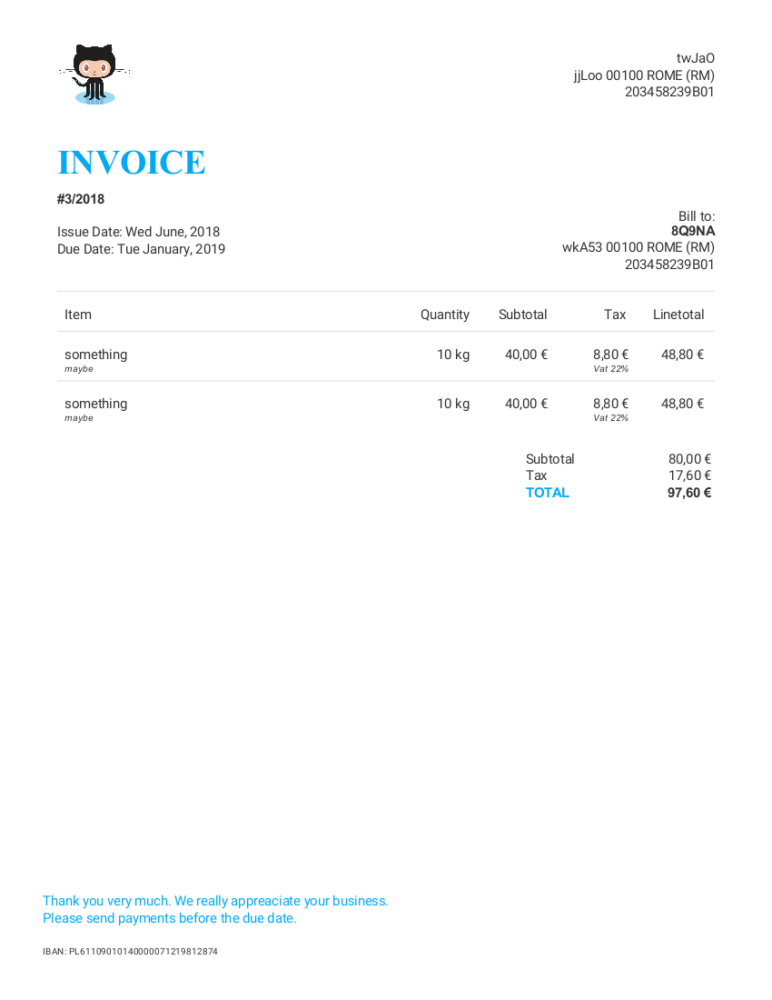

# lara-ore-invoice

[](https://travis-ci.org/railken/lara-ore-invoice)
[](https://github.styleci.io/repos/136634735)
[](https://opensource.org/licenses/MIT)

A laravel package to manage multiple invoices saved in the database
# Requirements

PHP 7.1 and later.


## Installation

You can install it via [Composer](https://getcomposer.org/) by typing the following command:

```bash
composer require railken/lara-ore-invoice
```

The package will automatically register itself.


## Documentation

Demo invoice generated

